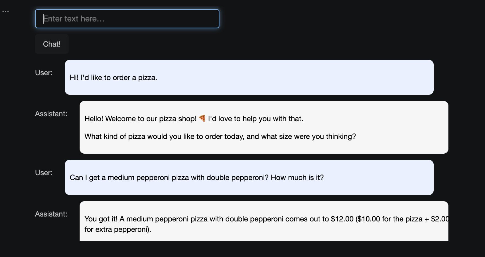

# OrderBot — AI Pizza Ordering Chatbot

A conversational chatbot that takes pizza orders through a simple chat interface, built as part of the **["ChatGPT Prompt Engineering for Developers"](https://www.deeplearning.ai/short-courses/chatgpt-prompt-engineering-for-developers/) course by OpenAI and DeepLearning.AI**. It adapts the original "Chat Format" / OrderBot exercise (originally designed for the OpenAI API) to run on **Google's Gemini API**, using its free tier, with **Panel** powering the GUI.

##  Demo



##  Features

- Conversational ordering flow — greets the customer, takes the order, asks pickup or delivery, collects payment
- Menu, toppings, drinks and prices loaded from an external `menu.csv` file (easy to edit without touching the code)
- Simple chat-style GUI built with [Panel](https://panel.holoviz.org/)
- Order summary generated as structured JSON at the end of the conversation
- Powered by Google's **Gemini API** (free tier)

## Tech Stack

- Python 3.9
- [google-generativeai](https://github.com/google-gemini/deprecated-generative-ai-python) — Gemini API client
- [Panel](https://panel.holoviz.org/) — interactive GUI widgets
- [python-dotenv](https://pypi.org/project/python-dotenv/) — environment variable management
- [pandas](https://pandas.pydata.org/) — reading the menu from CSV

##  Project Structure

```
orderbot/
├── orderbot.ipynb      # main notebook with the chatbot logic
├── menu.csv             # restaurant menu (editable, no code changes needed)
├── requirements.txt     # Python dependencies
├── .env                 # API key (not committed to git)
└── README.md
```

##  Setup

### 1. Clone the repository
```bash
   git clone https://github.com/Gulzhan-g/orderbot.git
   cd orderbot
```

### 2. Create a virtual environment and install dependencies
```bash
 python3 -m venv .venv
   source .venv/bin/activate  
   pip install -r requirements.txt
```

### 3. Get a free API key from Google AI Studio.
### 4. Create a file named .env in the project folder and put your own key in it:
```
GEMINI_API_KEY=your_api_key_here
```
### 5. Run the notebook
Open `orderbot.ipynb` in Jupyter or VS Code and run all cells in order.
## Editing the Menu
The menu lives in `menu.csv`. Just edit the prices or add new items — no code changes required:
```csv
category,item,size,price
pizza,pepperoni,large,12.95
pizza,pepperoni,medium,10.00
...
```
##  Order Summary (JSON)
After chatting with the bot and placing an order through the `dashboard` widget, run the following cell to turn the whole conversation into a structured JSON summary (itemized pizza, toppings, drinks, sides and total price):

```python
messages = context.copy()
messages.append(
    {'role': 'user', 'content': "create a json summary of the previous food order. Itemize the price for each item. \
The fields should be 1) pizza, price 2) list of toppings, price 3) list of drinks, include size and price 4) list of sides, include size and price 5) total price"}
)
response = get_completion_from_messages(messages, temperature=0)
print(response)
```
This reuses the full conversation history (`context`) and asks the model to summarize it — useful for turning a free-form chat order into structured data (e.g. for a kitchen ticket or a database record).

## Note on Free Tier Limits

This project uses the **Gemini API free tier**, which has a limited number of requests per day per model (e.g. 20 requests/day for some models at the time of writing). If you hit a `429 TooManyRequests` error, wait for the quota to reset or switch to a different Gemini model in the code.

##  License

This project is for educational purposes.
